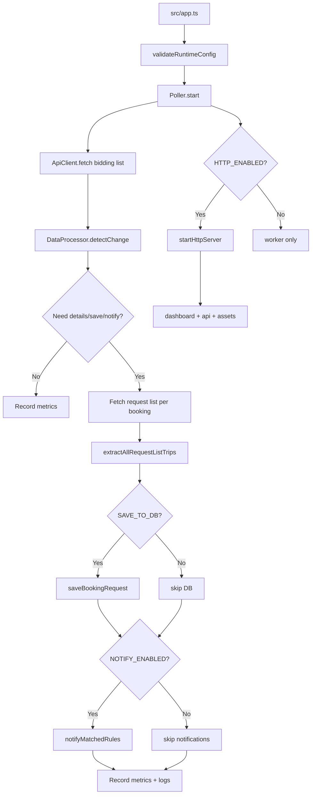

---
tags:
  - obsidian
  - spx
  - architecture
---

# Architecture

## Overview
SPX Bidding Poller มี 2 ส่วนหลัก

### 1) Worker
- entry point: `src/app.ts`
- orchestrator: `src/controllers/poller.ts`
- job:
  - validate env
  - poll SPX API
  - detect change
  - fetch detail requests
  - save history
  - notify rules
  - record metrics
  - shutdown gracefully

### 2) Dashboard
- server: `src/services/http-server.ts`
- login: `src/controllers/auth-controller.ts`
- dashboard controller: `src/controllers/dashboard-controller.ts`
- UI template: `src/views/dashboard.ts`
- static JS: `src/public/dashboard.js`
- authz: `src/services/authz.ts` with `viewer`, `editor`, `admin`

## Architecture diagram

## Data path
`SPX API` -> `ApiClient` -> `Poller` -> `Extractor` -> `DB / Notifier / Metrics`

## Supporting layers
- `src/config/env.ts` - config validation
- `src/db/client.ts` - MySQL pool and Drizzle client
- `src/repositories/*` - direct DB access
- `src/services/*` - business logic
- `src/utils/*` - logging and formatting

## API access model
- public: `POST /api/login`, `POST /api/logout`, `/health`, `/ready`, `/metrics`, dashboard login page
- authenticated viewer: `/api/history`, `/api/reports`
- editor: `/api/rules`, `/api/notifications`
- admin: `/api/users`, `/api/settings`, `/api/audit-logs`

## Production features
- security headers
- rate limit with cleanup
- JWT cookie auth
- role-based authorization
- static asset serving
- `/health` and DB-backed `/ready`
- Docker support
- smoke test support
- real Discord/LINE notification delivery
