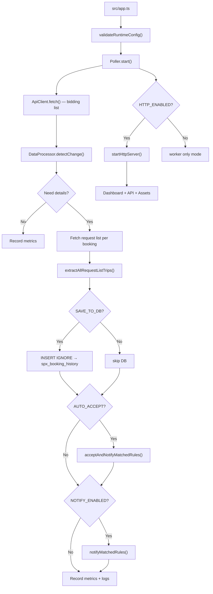

# Architecture

## Overview

SPX Bidding Poller ประกอบด้วย ==2 ส่วนหลัก== ที่ทำงานใน process เดียวกัน:

### 1) Polling Worker (Core Engine)

| Component | File | หน้าที่ |
|-----------|------|--------|
| Entry Point | `src/app.ts` | Parse CLI args, validate config, start Poller |
| Orchestrator | `src/controllers/poller.ts` | จัดการ polling loop, tick, shutdown |
| API Client | `src/services/api-client.ts` | เรียก SPX API + retry + error handling |
| Data Processor | `src/services/data-processor.ts` | Detect change via FNV-1a hash |
| Booking Extractor | `src/utils/booking-extractor.ts` | แปลง raw API → `ExtractedTripInfo` |
| DB Service | `src/services/db-service.ts` | Wrapper สำหรับ INSERT IGNORE |
| Notifier | `src/services/notifier.ts` | ส่ง Discord/LINE + auto-accept flow |
| Rule Engine | `src/services/notify-rules.ts` | Match trips กับ rules, mark fulfilled |
| Metrics | `src/services/metrics.ts` | Latency percentiles, success rate |
| Error Classifier | `src/utils/error-classifier.ts` | จำแนก error เป็น 6 categories |

### 2) Web Dashboard — React SPA (`HTTP_ENABLED=true`)

| Component | File | หน้าที่ |
|-----------|------|--------|
| HTTP Server | `src/services/http-server.ts` | Fastify + CORS + JWT + Rate Limit + SPA serving |
| Auth Controller | `src/controllers/auth-controller.ts` | Login/Logout/Refresh/Me API |
| Dashboard Controller | `src/controllers/dashboard-controller.ts` | Health + metrics + events API |
| Rules Controller | `src/controllers/rules-controller.ts` | CRUD notification rules API |
| History Controller | `src/controllers/history-controller.ts` | Query booking history API |
| Users Controller | `src/controllers/users-controller.ts` | User management API (admin) |
| Settings Controller | `src/controllers/settings-controller.ts` | .env settings via API |
| Audit Controller | `src/controllers/audit-controller.ts` | Audit log API |
| Report Controller | `src/controllers/report-controller.ts` | CSV export API |
| Bidding Controller | `src/controllers/bidding-controller.ts` | Manual booking accept API |
| Notify Controller | `src/services/notify-controller.ts` | Notification preview/test API |
| Authz | `src/services/authz.ts` | RBAC: `viewer` < `editor` < `admin` |

#### React SPA Frontend (`src/frontend/`)

| Component | File | หน้าที่ |
|-----------|------|--------|
| Entry Point | `src/frontend/main.tsx` | React 19 entry, QueryClient, Router |
| Root Layout | `src/frontend/routes/__root.tsx` | App shell, auth check, sidebar |
| Router | `src/frontend/routes/*.tsx` | 11 pages (Dashboard, History, Audit, Users, Settings, Notifications, Reports, LINE Bot, Auto-Accept History, Login) |
| UI Primitives | `src/frontend/components/ui/*.tsx` | Button, Card, Input, Dialog, Label, Skeleton, Avatar, Badge, Switch |
| Business Components | `src/frontend/components/*.tsx` | DataTable (with sorting), EmptyState, Sparkline, Breadcrumb, CreateRuleDialog, EditRuleDialog, DeleteConfirmDialog, VehicleTypeMultiSelect, SettingsLineBotSection |
| Layout | `src/frontend/components/layout/AppLayout.tsx` | Sidebar (collapsible sections, keyboard shortcuts), Top bar (breadcrumbs, Cmd+K search, notification bell, user dropdown), Mobile bottom tab bar |
| API Client | `src/frontend/lib/api.ts` | Typed fetch wrapper with auth handling |
| Auth Hook | `src/frontend/hooks/useAuth.ts` | Login/logout/auth state |
| SSE Hook | `src/frontend/hooks/useSse.ts` | Real-time metrics updates |
| Styles | `src/frontend/index.css` | Tailwind CSS v4 with custom theme, animations, glass morphism |

## Settings Storage

Settings ถูกเก็บใน DB (`app_settings` table) ตั้งแต่ v2.0:

```
Startup: .env → process.env → loadDbSettingsIntoEnv() (DB overrides env)
Read:    readStoredSettings() = merge(Defaults, process.env, DB) — DB wins
Write:   Web UI → upsertAppSettings(DB) + reloadSettingsLive() → สดทันที
```

> [!info] ไม่ต้อง restart
> `ApiClient` อ่าน `env` ทุกครั้งที่ fetch (ไม่ cache ใน constructor)  
> `Poller` อ่าน `POLL_INTERVAL_MS` ทุก tick ผ่าน `getIntervalMs()`  
> เมื่อ save settings → sync DB → process.env → env object → ระบบทำงานต่อด้วยค่าใหม่ทันที

## AppLayout Features

| Feature | Description |
|---------|-------------|
| Sidebar | Collapsible sections (Menu / Administration), active glow indicator, hover shortcut keys (⌘1-⌘9) |
| Top Bar | Breadcrumbs, Cmd+K quick search modal, notification bell, user avatar dropdown |
| Mobile | Bottom tab bar (5 tabs), hamburger-less navigation |
| Keyboard | `⌘B` toggle sidebar, `⌘K` quick search, `Esc` close modals |
| Loading | SkeletonTable / SkeletonCard on every data page |
| Empty | EmptyState component with icon + action button |

## Architecture Diagram



## Data Path

> [!info] Data Flow Direction
> `SPX API` → `ApiClient` → `Poller` → `Extractor` → `DB / Notifier / Metrics`
> 
> ข้อมูลไหลทิศทางเดียว ไม่มี feedback loop จาก DB กลับไป API

## Feature Flag System

ระบบใช้ `.env` + DB (`app_settings` table) เป็น feature flags:

```
FETCH_DETAILS=true    → แสดงรายละเอียด trip ใน console
SAVE_TO_DB=true       → บันทึกลง MySQL
NOTIFY_ENABLED=true   → ส่ง notification
AUTO_ACCEPT_ENABLED=true → รับงานอัตโนมัติ  
HTTP_ENABLED=true     → เปิด Web Dashboard
```

> [!info] Live Reload
> Settings แก้ไขผ่าน Web UI (`/settings`) → บันทึกลง DB → sync กลับเข้า `process.env` และ `env` object ทันที
> API credentials (COOKIE, DEVICE_ID, API_URL) อ่านจาก `env` ทุกครั้งที่ fetch — **ไม่ต้อง restart server**

> [!warning] Feature Dependencies
> - `SAVE_TO_DB`, `HTTP_ENABLED`, `AUTO_ACCEPT_ENABLED` ต้องการ DB config ทั้งหมด
> - `NOTIFY_ENABLED` ต้องการอย่างน้อย `LINE_NOTIFY_TOKEN` หรือ `DISCORD_WEBHOOK_URL`
> - `HTTP_ENABLED` ต้องการ `JWT_SECRET`, `COOKIE_SECRET`, `ADMIN_PASSWORD`

## Supporting Layers

- [[env-reference|Config]] — `src/config/env.ts` — validation + .env loading
- [[database-schema|Database]] — `src/db/client.ts` — MySQL pool + Drizzle + auto-create tables
- **Repositories** — `src/repositories/*` — direct DB access layer
- **Services** — `src/services/*` — business logic layer  
- **Utils** — `src/utils/*` — logging, hashing, error classification
