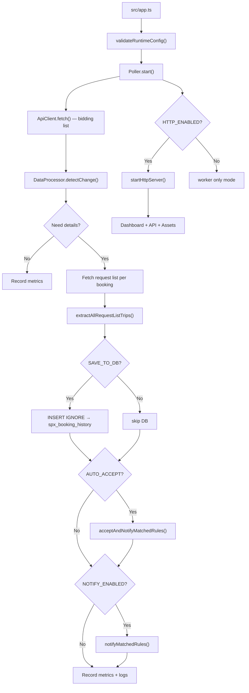

# Architecture

## Overview

SPX Bidding Poller ประกอบด้วย ==2 ส่วนหลัก== ที่ทำงานใน process เดียวกัน:

### 1) Polling Worker (Core Engine)

| Component | File | หน้าที่ |
|-----------|------|--------|
| Entry Point | `src/app.ts` | Parse CLI args, validate config, start Poller |
| Orchestrator | `src/controllers/poller.ts` | จัดการ polling loop, tick, shutdown |
| API Client | `src/services/api-client.ts` | เรียก SPX API + retry + error handling |
| Data Processor | `src/services/data-processor.ts` | Detect change via FNV-1a hash |
| Booking Extractor | `src/utils/booking-extractor.ts` | แปลง raw API → `ExtractedTripInfo` |
| DB Service | `src/services/db-service.ts` | Wrapper สำหรับ INSERT IGNORE |
| Notifier | `src/services/notifier.ts` | ส่ง Discord/LINE + auto-accept flow |
| Rule Engine | `src/services/notify-rules.ts` | Match trips กับ rules, mark fulfilled |
| Metrics | `src/services/metrics.ts` | Latency percentiles, success rate |
| Error Classifier | `src/utils/error-classifier.ts` | จำแนก error เป็น 6 categories |

### 2) Web Dashboard (Optional — `HTTP_ENABLED=true`)

| Component | File | หน้าที่ |
|-----------|------|--------|
| HTTP Server | `src/services/http-server.ts` | Fastify + CORS + JWT + Rate Limit |
| Auth Controller | `src/controllers/auth-controller.ts` | Login/Logout/Refresh/Me |
| Dashboard Controller | `src/controllers/dashboard-controller.ts` | HTML rendering + health + metrics |
| Rules Controller | `src/controllers/rules-controller.ts` | CRUD notification rules |
| History Controller | `src/controllers/history-controller.ts` | Query booking history |
| Users Controller | `src/controllers/users-controller.ts` | User management (admin) |
| Settings Controller | `src/controllers/settings-controller.ts` | .env settings via UI |
| Audit Controller | `src/controllers/audit-controller.ts` | Audit log viewer |
| Report Controller | `src/controllers/report-controller.ts` | CSV export |
| Bidding Controller | `src/controllers/bidding-controller.ts` | Manual booking accept |
| Notify Controller | `src/services/notify-controller.ts` | Notification preview/test |
| Authz | `src/services/authz.ts` | RBAC: `viewer` < `editor` < `admin` |

## Architecture Diagram



## Data Path

> [!info] Data Flow Direction
> `SPX API` → `ApiClient` → `Poller` → `Extractor` → `DB / Notifier / Metrics`
> 
> ข้อมูลไหลทิศทางเดียว ไม่มี feedback loop จาก DB กลับไป API

## Feature Flag System

ระบบใช้ `.env` เป็น feature flags:

```
FETCH_DETAILS=true    → แสดงรายละเอียด trip ใน console
SAVE_TO_DB=true       → บันทึกลง MySQL
NOTIFY_ENABLED=true   → ส่ง notification
AUTO_ACCEPT_ENABLED=true → รับงานอัตโนมัติ  
HTTP_ENABLED=true     → เปิด Web Dashboard
```

> [!warning] Feature Dependencies
> - `SAVE_TO_DB`, `HTTP_ENABLED`, `AUTO_ACCEPT_ENABLED` ต้องการ DB config ทั้งหมด
> - `NOTIFY_ENABLED` ต้องการอย่างน้อย `LINE_NOTIFY_TOKEN` หรือ `DISCORD_WEBHOOK_URL`
> - `HTTP_ENABLED` ต้องการ `JWT_SECRET`, `COOKIE_SECRET`, `ADMIN_PASSWORD`

## Supporting Layers

- [[env-reference|Config]] — `src/config/env.ts` — validation + .env loading
- [[database-schema|Database]] — `src/db/client.ts` — MySQL pool + Drizzle + auto-create tables
- **Repositories** — `src/repositories/*` — direct DB access layer
- **Services** — `src/services/*` — business logic layer  
- **Utils** — `src/utils/*` — logging, hashing, error classification
