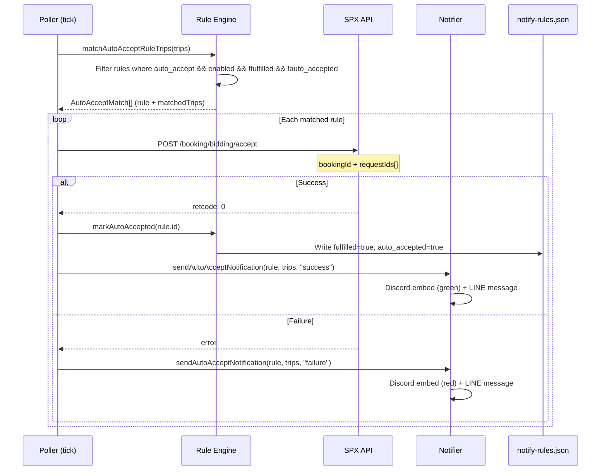

# Auto-Accept Engine

## Overview

Auto-Accept เป็น feature ที่ให้ระบบส่ง API call ไปรับงาน (accept booking) อัตโนมัติ เมื่อ trip ตรงกับ rule ที่มี `auto_accept: true`

> [!danger] ความเสี่ยง
> Auto-Accept ==ส่ง API จริง== ไปยัง SPX Agency Portal — เมื่อ accept แล้ว **ไม่สามารถยกเลิกได้**
> ตรวจสอบ rules อย่างระมัดระวังก่อนเปิดใช้งาน

## Auto-Accept Flow



## Accept API Call

```typescript
// src/services/api-client.ts
async acceptBookingRequests(bookingId: number, requestIds: number[]) {
  const url = this.baseUrl + "/booking/bidding/accept";
  const body = {
    booking_id: bookingId,
    request_ids: requestIds,
  };
  // Uses same headers + cookies as polling
  // Retry: 3 attempts with exponential backoff
}
```

> [!note] Accept Endpoint Derivation
> URL ถูก derive จาก `API_URL` โดยแทนที่ `/booking/bidding/list` ด้วย `/booking/bidding/accept`
> ถ้า `API_URL` เปลี่ยน path shape จะต้องอัปเดต logic ใน `api-client.ts`

## Rule Conditions

Rule จะ trigger auto-accept เมื่อ:

1. ✅ `auto_accept: true`
2. ✅ `enabled: true`
3. ✅ `fulfilled: false`
4. ✅ `auto_accepted: false`
5. ✅ Trip match >= `need` count

## Manual Accept (via Dashboard)

นอกจาก auto-accept แล้ว ผู้ใช้สามารถ accept ด้วยมือผ่าน Dashboard:

```
POST /api/bidding/accept
{
  "bookingId": 12345,
  "requestIds": [67890],
  "confirm": true
}
```

> [!tip] Safety Guard
> `confirm: true` เป็น required field — ป้องกันการเรียกโดยไม่ตั้งใจ
> ทุก manual accept ถูก log ใน audit trail

## Notification Messages

### Success (Discord)
```
✅ Auto-accepted: NERC-C → สุวรรณภูมิ
Rule: "NERC-C 4ล้อ สุวรรณภูมิ"
Request IDs: 67890, 67891
Booking ID: 12345
```

### Failure (Discord)
```
❌ Auto-accept failed: NERC-C → สุวรรณภูมิ
Rule: "NERC-C 4ล้อ สุวรรณภูมิ"
Error: retcode -1 (session expired)
```

## Limitations

> [!warning] ข้อจำกัดปัจจุบัน
> - ❌ ไม่มี retry เมื่อ accept ล้มเหลว (mark failed ทันที)
> - ❌ ไม่มี scheduling (เปิด/ปิดตามเวลา)
> - ❌ ไม่มี scoring (accept ทุก trip ที่ตรง ไม่เลือก)
> - ⚠️ ถ้า SPX session cookie หมดอายุ → accept จะ fail ทั้งหมด

## ดูเพิ่มเติม
- [[notification-system]] — Rule engine ละเอียด
- [[api-routes]] — Accept API endpoint
- [[error-handling]] — Error classification สำหรับ accept failures
