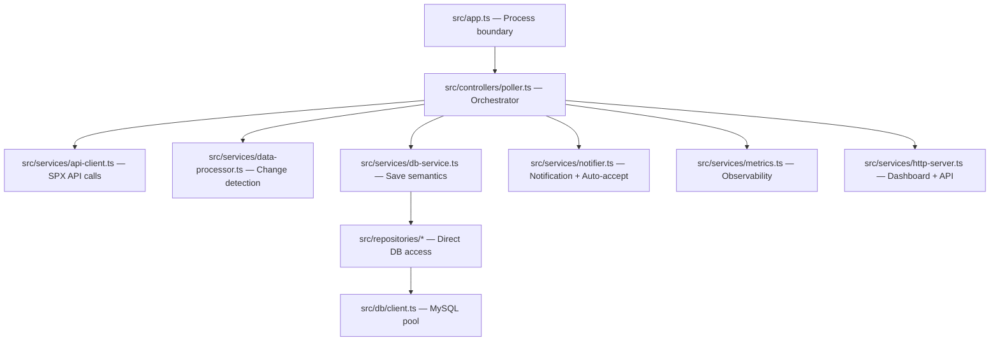

# SPX Backend Worker Patterns

## Architecture Fit

> [!note] Worker-First Architecture
> SPX เป็น ==polling worker== ไม่ใช่ REST/GraphQL server ทั่วไป
> HTTP server เป็น opt-in (`HTTP_ENABLED=true`) สำหรับ health/metrics/dashboard เท่านั้น

## Layers

| Layer | File | Responsibility |
|-------|------|----------------|
| Process boundary | `src/app.ts` | Parse CLI, validate env, start worker |
| Orchestrator | `src/controllers/poller.ts` | Polling loop, signal handling, metrics |
| API integration | `src/services/api-client.ts` | HTTP calls, retry, session detection |
| Save semantics | `src/services/db-service.ts` | `INSERT IGNORE` write-once |
| Rule engine | `src/services/notify-rules.ts` | Stateful match, auto-fulfill |
| Notification | `src/services/notifier.ts` | Discord/LINE delivery + auto-accept flow |
| Metrics | `src/services/metrics.ts` | Latency, success rate, session health |
| HTTP | `src/services/http-server.ts` | Fastify, RBAC, rate limiting |
| Repository | `src/repositories/*` | Direct SQL, polling-logic-free |
| DB client | `src/db/client.ts` | Pool lifecycle, pool stats, table creation |
| Error classifier | `src/utils/error-classifier.ts` | Categorize errors into 6 types |

## Shutdown

> [!important] Graceful Shutdown Chain
> 1. Stop poll timer (`clearTimeout`)
> 2. Stop metrics persistence timer (`clearInterval`)
> 3. Persist ==final metrics snapshot==
> 4. Wait for active tick to complete
> 5. Print footer stats
> 6. Stop HTTP server
> 7. Close MySQL pool
> 8. `process.exit(exitCode)`

- `SIGINT`/`SIGTERM` → call `Poller.stop()`
- Scripts ควรใช้ `closePool()` ใน `finally` แทน `getPool().end()`

## Error Handling

> [!tip] Non-Fatal Polling
> Polling errors ไม่ทำให้ระบบล่ม — แค่ skip tick แล้ว retry ใน tick ถัดไป

- Expected duplicate saves → return `skipped` ไม่ throw
- Unexpected DB/API failures → log โดยไม่เปิดเผย `.env` values
- API validation อยู่ใน `ApiClient` เพื่อให้ downstream ได้ known response shapes
- API calls ใช้ retry (3 retries, exponential backoff, 1s base delay + jitter)
- Session expiry detected จาก retcodes → alert via Discord/LINE (throttle 10 min)
- Error classification → 6 categories: `session_expired`, `network`, `rate_limited`, `api_error`, `validation`, `unknown`

ดู [[error-handling]] สำหรับ classification details

## What's Already Implemented

- [x] Fastify middleware, CORS, JWT auth, RBAC
- [x] Role-based rate limiting (viewer/editor/admin)
- [x] Request ID tracing (`X-Request-Id`)
- [x] DB pool monitoring + health checks
- [x] Metrics persistence (every 5 min)
- [x] Auto-accept with retry

## What Not To Add Yet

- ❌ DI container — dependency graph ยังเล็กพอ
- ❌ Queue worker — polling ไม่ produce work ที่ outlive single tick
- ❌ GraphQL — API เป็น internal tooling ไม่จำเป็น

## ดูเพิ่มเติม
- [[architecture]] — System architecture diagram
- [[runtime-flow]] — Tick flow + shutdown sequence
- [[nodejs-best-practices]] — Node.js specific patterns
- [[error-handling]] — Error classification system
