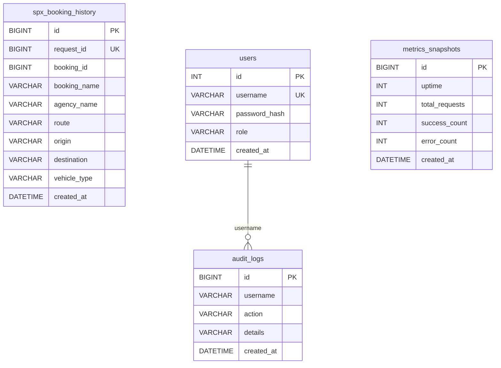

# Database Schema

## Overview

ระบบใช้ MySQL (InnoDB) กับ charset `utf8mb4_0900_ai_ci` ผ่าน Drizzle ORM + mysql2

> [!note] Schema Sources
> Schema ถูกกำหนดไว้ 2 ที่:
> 1. **Drizzle schema** — `src/db/schema.ts` (for type-safe queries)
> 2. **Runtime CREATE TABLE** — `src/db/client.ts` (auto-create on startup)
> 
> ==ต้องเปลี่ยนทั้ง 2 ที่== เมื่อแก้ไข schema

## Tables

### 1. `spx_booking_history`

บันทึกประวัติ booking requests ที่ poller พบ — ใช้ `INSERT IGNORE` เขียนครั้งเดียวไม่ UPDATE

| Column | Type | Nullable | Note |
|--------|------|----------|------|
| `id` | BIGINT UNSIGNED | NO | PK, AUTO_INCREMENT |
| `request_id` | BIGINT UNSIGNED | NO | **UNIQUE** — จาก request list API |
| `booking_id` | BIGINT UNSIGNED | YES | จาก bidding list API |
| `booking_name` | VARCHAR(255) | YES | ชื่อ booking |
| `agency_name` | VARCHAR(255) | YES | ชื่อ agency |
| `route` | VARCHAR(255) | NO | "ต้นทาง -> ปลายทาง" |
| `origin` | VARCHAR(255) | YES | ชื่อสถานีต้นทาง |
| `destination` | VARCHAR(255) | YES | ชื่อสถานีปลายทาง |
| `cost_type` | VARCHAR(50) | YES | Fixed, By Hour, By Weight, By Distance |
| `trip_type` | VARCHAR(50) | YES | Round Trip, One Way |
| `shift_type` | VARCHAR(50) | YES | By Land, Day Shift, Night Shift |
| `vehicle_type` | VARCHAR(50) | YES | เช่น 4ล้อ, 6ล้อ |
| `standby_datetime` | VARCHAR(50) | YES | วัน/เวลา standby |
| `acceptance_status` | INT | YES | สถานะการรับงาน |
| `assignment_status` | INT | YES | สถานะการมอบหมาย |
| `created_at` | DATETIME | NO | DEFAULT CURRENT_TIMESTAMP |

**Indexes:**
- `request_id_idx` — UNIQUE INDEX on `request_id`
- `booking_id_idx` — INDEX on `booking_id`
- `created_at_idx` — INDEX on `created_at`

> [!warning] Write-Once Semantics
> `INSERT IGNORE` หมายความว่า record จะไม่ถูก update หลังจากเขียนครั้งแรก
> ถ้า `acceptance_status` เปลี่ยนหลังจากนั้น DB จะไม่รู้

### 2. `users`

ผู้ใช้งาน Web Dashboard

| Column | Type | Nullable | Note |
|--------|------|----------|------|
| `id` | INT | NO | PK, AUTO_INCREMENT |
| `username` | VARCHAR(50) | NO | UNIQUE |
| `password_hash` | VARCHAR(255) | NO | bcrypt hash |
| `role` | VARCHAR(20) | NO | DEFAULT `viewer` |
| `created_at` | DATETIME | NO | DEFAULT CURRENT_TIMESTAMP |

### 3. `audit_logs`

Audit trail สำหรับทุกการกระทำใน Dashboard

| Column | Type | Nullable | Note |
|--------|------|----------|------|
| `id` | BIGINT UNSIGNED | NO | PK, AUTO_INCREMENT |
| `username` | VARCHAR(50) | NO | ผู้ทำรายการ |
| `action` | VARCHAR(100) | NO | เช่น Login, Add Rule, Accept Booking |
| `details` | VARCHAR(1000) | YES | รายละเอียดเพิ่มเติม |
| `created_at` | DATETIME | NO | DEFAULT CURRENT_TIMESTAMP |

### 4. `metrics_snapshots` %%new%%

เก็บ snapshot ของ metrics ทุก 5 นาที — ป้องกัน data loss หลัง restart

| Column | Type | Nullable | Note |
|--------|------|----------|------|
| `id` | BIGINT UNSIGNED | NO | PK, AUTO_INCREMENT |
| `uptime` | INT | NO | วินาทีที่ทำงาน |
| `total_requests` | INT | NO | จำนวน poll ทั้งหมด |
| `success_count` | INT | NO | poll สำเร็จ |
| `error_count` | INT | NO | poll ล้มเหลว |
| `success_rate` | VARCHAR(10) | NO | อัตราความสำเร็จ (%) |
| `latency_avg` | INT | NO | Latency เฉลี่ย (ms) |
| `latency_p95` | INT | NO | Latency p95 (ms) |
| `latency_p99` | INT | NO | Latency p99 (ms) |
| `total_records_seen` | INT | NO | จำนวน record ที่เจอ |
| `changes_detected` | INT | NO | จำนวนครั้งที่ข้อมูลเปลี่ยน |
| `trips_inserted` | INT | NO | trips ที่ insert สำเร็จ |
| `trips_skipped` | INT | NO | trips ที่ skip (ซ้ำ) |
| `created_at` | DATETIME | NO | DEFAULT CURRENT_TIMESTAMP |

**Indexes:**
- `metrics_created_at_idx` — INDEX on `created_at`

## ER Diagram

## Table Auto-Creation

> [!tip] Tables ถูกสร้างอัตโนมัติ
> - `spx_booking_history` → `ensureSpxBookingHistoryTable()` ก่อน INSERT แรก
> - `users` + `audit_logs` → `ensureDashboardTables()` ตอน startup เมื่อ `HTTP_ENABLED`
> - `metrics_snapshots` → `ensureMetricsTable()` ตอน startup เมื่อ `SAVE_TO_DB`
>
> ทำให้ไม่ต้อง run migration ก่อนเริ่มระบบ

## ดูเพิ่มเติม
- [[architecture]] — ตำแหน่งของ DB ในระบบ
- [[env-reference]] — DB config variables
- [[mysql-best-practices]] — MySQL tuning patterns
