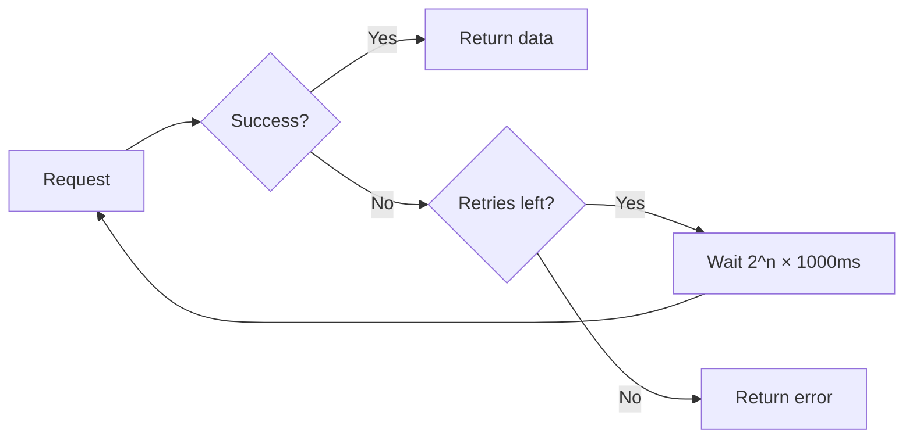

# Error Handling

## Error Classification System

ระบบใช้ `error-classifier.ts` จำแนก error เป็น 6 categories:

| Category | Retryable | ตัวอย่าง | การจัดการ |
|----------|-----------|---------|----------|
| `session_expired` | ❌ | HTTP 401, retcode 10001/10002 | แจ้งเตือนให้เปลี่ยน cookie |
| `network` | ✅ | Timeout, DNS failure, HTTP 408 | Retry with exponential backoff |
| `rate_limited` | ✅ | HTTP 429 | ลด poll interval |
| `api_error` | ✅ | HTTP 5xx, non-zero retcode | Retry, log warning |
| `validation` | ❌ | HTTP 4xx (ยกเว้น 401/403/429) | Fix request parameters |
| `unknown` | ❌ | Unrecognized error pattern | Log for investigation |

## Retry Strategy (API Client)



> [!note] Retry Configuration
> - **Max retries:** 3
> - **Backoff formula:** `2^attempt × 1000ms` (1s, 2s, 4s)
> - **Applies to:** fetch(), fetchBookingRequestList()
> - **Does NOT apply to:** acceptBookingRequests() (accept failure = immediate)

## Error Handling Patterns

### Polling Loop
```typescript
// poller.ts - tick()
if (!result.success) {
  const classified = classifyPollingError(result.httpStatus, result.error);
  metrics.recordPoll(result.latencyMs, false, classified.category, null);
  logger.error("poll-failed", { ...formatClassifiedError(classified) });
  return; // ← ไม่ throw, แค่ skip tick นี้
}
```

> [!important] Non-Fatal Errors
> Polling errors จะไม่ทำให้ระบบหยุดทำงาน — แค่ skip tick แล้ว retry ใน tick ถัดไป

### Database Saves
```typescript
// INSERT IGNORE → duplicate = skip, not error
// Connection errors → logged, metrics updated
```

### Notification Sends
```typescript
// Discord/LINE ส่งแยก independent
// ถ้า Discord fail → LINE ยังส่ง
// ถ้าทั้งคู่ fail → log error, rule ยังถูก mark fulfilled
```

### Shutdown
```typescript
// Graceful shutdown chain:
// 1. Stop poll timer
// 2. Stop metrics persistence timer  
// 3. Persist final metrics snapshot
// 4. Wait for active tick to complete
// 5. Stop HTTP server
// 6. Close MySQL pool
// 7. Exit with proper code
```

## Session Expiry Detection

> [!danger] สำคัญที่สุด
> SPX API ใช้ session cookie — เมื่อ cookie หมดอายุระบบจะได้รับ retcode ที่บ่งบอก session expired
> 
> **retcodes ที่หมายถึง session expired:** `401, 403, -1, 10001, 10002`
> 
> เมื่อเกิดขึ้น:
> 1. Error ถูก classify เป็น `session_expired`
> 2. Log ถูกบันทึกเป็น error level
> 3. ผู้ใช้ต้องอัปเดต `COOKIE` ใน `.env` (หรือผ่าน Settings UI)

## Structured Log Format

```json
{
  "level": "error",
  "event": "poll-failed",
  "errorCategory": "session_expired",
  "errorMessage": "Session expired",
  "retryable": false,
  "httpStatus": 200,
  "retcode": 10001,
  "latencyMs": 245
}
```

## Health Check Endpoints

| Endpoint | What it checks | Failure response |
|----------|---------------|-----------------|
| `GET /health` | In-memory metrics | Always 200 (uptime, errorRate) |
| `GET /ready` | `SELECT 1` to MySQL | 503 + `{ ready: false }` |

## ดูเพิ่มเติม
- [[runtime-flow]] — Error handling ในแต่ละ phase
- [[architecture]] — ตำแหน่งของ error classifier
- [[production-cautions]] — ข้อควรระวังเรื่อง session
