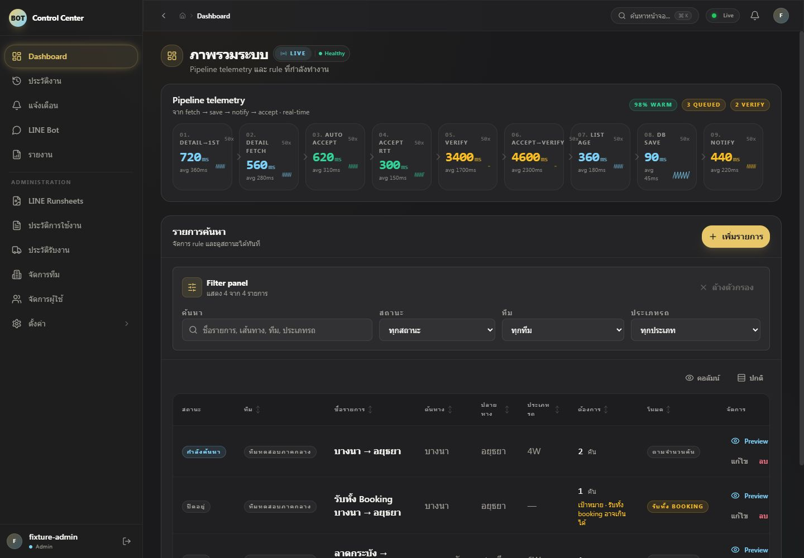
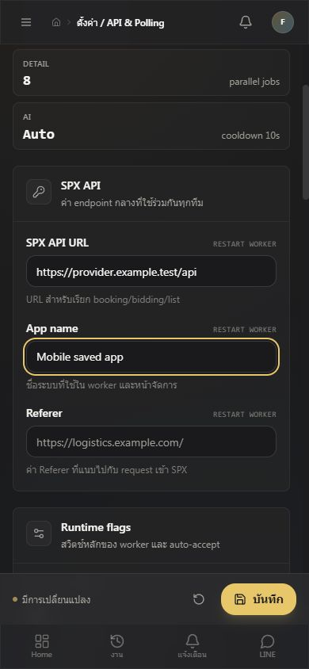
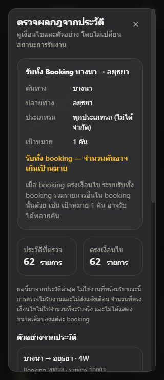

# ผล review งาน login รายทีม กฎรับงาน และ frontend regression

PR: [#96](https://github.com/fastest4u/SPX/pull/96) — ตรวจจากฐาน `68ab5280` ใน worktree แยก โดยไม่รวมงาน A3 เดิม ผู้ใช้ยืนยันว่าโหมดรับทั้งหมดรับได้ทั้ง booking แม้เกินเป้าหมาย และต้องแสดงผลกระทบก่อนเปิดกฎ

## ปัญหาที่พบและแก้ไขแล้ว

| ระดับ | หลักฐาน | ผลกระทบและการแก้ไข |
| --- | --- | --- |
| P1 | `src/services/provider-auth/session-service.ts:111`, `nextFailure` | การลองเชื่อมบัญชีใหม่ที่ล้มเหลวเปลี่ยนสถานะทีม manual จน poller ปฏิเสธ session เดิมที่ยังใช้ได้ แก้ให้รักษาสถานะ manual และ Cookie/Device ID เดิม พร้อมคง cooldown ของการลองบัญชีใหม่ มี regression ทั้งรหัสผ่านผิดและ provider ขัดข้อง |
| P2 | `src/services/provider-auth/session-service.ts:250`, `recoverSession` | การตรวจ identity หลังถูกปฏิเสธไม่เก็บ Retry-After และเรียกพร้อมกันได้หลายครั้ง แก้ให้รวมคำขอใน process ใช้ lease ข้าม worker ตรวจ epoch ก่อนเขียนผล และบันทึก cooldown 30–300 วินาที การตอบกลับชั่วคราวไม่ทำให้ส่งรหัสผ่านซ้ำ |
| P2 | `src/frontend/components/RuleEditorDialog.tsx:176`, `src/frontend/components/RuleReviewSummary.tsx:12` | เมื่อ admin เปลี่ยนโหมดรับทั้งหมดระหว่างผู้ใช้เปิด editor ค่าเดิมค้างและขวางการยืนยัน แก้ให้ใช้โหมดที่ server ส่งในผลตรวจล่าสุด รักษาข้อมูลที่ผู้ใช้แก้ และขอการยืนยันใหม่ตามผลตรวจ มี browser regression ครอบคลุมการเปลี่ยนโหมดทั้งสองทิศทางและสิทธิ์ admin |
| P2 | `.github/workflows/deploy.yml:4`, ขั้นตอน `Install browser test dependencies` | ชุดทดสอบเพิ่ม browser แต่ CI ไม่มีขั้นติดตั้ง Chromium ทำให้เครื่องใหม่รันไม่ได้ เพิ่ม browser/OS dependencies และรัน quality gates บน PR ด้วย แยกคิว PR จาก production; deploy job ยังคงจำกัดเฉพาะ main |
| P3 | `scripts/run-tests.mjs:37`, การค้นหาไฟล์ทดสอบ | accessibility regression แบบ `.test.tsx` ไม่ถูกรันด้วย `npm test` แก้ให้ค้นหาทั้ง TS และ TSX และยืนยันว่าไฟล์ดังกล่าวผ่านในชุดทดสอบหลัก |
| P3 | `tests/frontend-provider-auth-browser.test.ts:34`, `tests/frontend-team-provider-auth-settings.test.ts:26`, `scripts/run-tests.mjs:25` | browser fixture ใช้ cache ร่วมและ cold startup เกินเวลารอเมื่อรันร่วมกับงานตรวจอื่น แก้ให้แยก cache/entry ไม่โหลด env ปิด watcher เพิ่มเวลานำทางเป็น 30 วินาที และให้เฉพาะสาม browser suites มี deadline 180 วินาที ทดสอบเส้นทาง timeout ให้รายงานความล้มเหลวได้ครบ |
| P3 | `docs/runbooks/team-provider-auth.md`, ส่วน Status and API / Local verification | runbook ยังระบุปัญหา UI ที่แก้แล้วและผลตรวจจาก workspace ที่รวม A3 แก้ให้ตรงกับพฤติกรรม feedback ปัจจุบันและผลตรวจชุด PR ที่แยกแล้ว |

ไม่พบ P0; พบ 7 รายการ แก้แล้ว 7 รายการ ไม่มี finding ค้างจากการตรวจรอบสุดท้าย

## ผลตรวจครบ 8 หมวด

| หมวด | ผลตรวจ |
| --- | --- |
| ความถูกต้องและ Logic | แก้ manual session และโหมดรับงานค้าง ตรวจ preview/token และกติกาการรับทั้ง booking |
| ความปลอดภัย | ตรวจ own-team/admin authorization, การเข้ารหัส, safe error/status และการไม่คืน password/cookie ใน provider status; fixture ใช้ข้อมูลจำลอง |
| ความเสถียรและ Error Handling | แก้ identity cooldown/lease ตรวจ timeout, epoch, challenge และการไม่ replay คำขอรับงานหรือรหัสผ่าน |
| ประสิทธิภาพ | รวมคำขอตรวจ session ที่ซ้ำกัน จำกัด cooldown และจำนวน status checks; แยก Vite cache ของชุดทดสอบ |
| Maintainability และอ่านง่าย | ใช้ขอบเขต service/repository เดิม ตรวจ TypeScript, import และเอกสารให้ตรง implementation |
| สถาปัตยกรรมและ Design | ตรวจการแยก provider account จาก dashboard account และการต่อ runtime cache/lease; ไม่มี generated/runtime artifacts ใน PR |
| Testing และ Quality Gates | เพิ่ม regression ที่ทำให้พบข้อผิดพลาดจริง รวม TSX ใน runner และเพิ่ม browser dependency/PR CI |
| Compatibility และความเสี่ยง Deploy | ตรวจ migration 040 และการใช้ encryption key เดิม ทีม manual ใช้งานต่อได้; live migration ยังไม่ได้ทดลองในรอบนี้ |

## หลักฐานการตรวจ

- `npm run typecheck`: ผ่าน backend และ frontend ใน isolated checkout
- `npm run build`: ผ่านหลังแก้ production code ทั้งหมด
- `npm run lint`: ผ่านหลังแก้ production code และ browser fixtures
- `npm test`: 115 ผ่าน / 1 ล้มเหลว / 116 ไฟล์ในรอบแรก โดยไฟล์ที่ล้มเหลวคือ provider browser startup timeout
- `npm test -- frontend-provider-auth-browser`: ผ่านหลังแก้ harness และ deadline (41.6 วินาที)
- Rule browser regression ผ่าน ทั้งเปลี่ยนโหมด false→true, true→false และ admin เลือกโหมดเอง รวมการย้อนกลับแก้ข้อมูล/ขอการยืนยันใหม่
- Auth regression ผ่านทั้ง manual retention, lease ข้าม owner, bounded Retry-After และ stale epoch
- `TEST_TIMEOUT_MS=1` กับไฟล์ทดสอบหนึ่งไฟล์: runner จบด้วย exit 1 และสรุป TIMEOUT ได้ตามตั้งใจ
- GitHub CI เป็นผลตรวจเต็มชุดบน commit สุดท้าย โปรดดู checks ของ [PR #96](https://github.com/fastest4u/SPX/pull/96/checks) ก่อน merge

จำนวนไฟล์ข้างต้นเป็นผล runner; ชุด E2E เดิมที่กำหนด `RUN_E2E=true` ยังคงข้ามตาม guard จึงไม่ใช่หลักฐานทดสอบระบบจริง ทุกรอบนี้ใช้ memory database และ provider จำลอง ไม่ยืนยัน live MySQL, CAPTCHA/OTP หรืออุปกรณ์จริงครบทุกขนาด

## ภาพประกอบจาก frontend regression

ภาพใช้ข้อมูล fixture แสดง desktop และหน้าจอแคบตาม flow ที่ตรวจแล้ว รายงาน regression เดิมอยู่ใน [verification](../2026-09-11-frontend-regression/verification.md)

## ข้อจำกัดการ rollout

ต้องใช้ migration `040_add_team_provider_auth.sql` ผ่านกระบวนการ migration ปกติก่อนเริ่ม API/worker รุ่นใหม่ และใช้ encryption key เดิมร่วมกันทุก role การ merge main เรียก workflow deploy ที่ repository มีอยู่แล้ว การ review นี้ไม่ได้เรียก deploy/restart ด้วยตนเอง และต้องตรวจ commit/container บน production แบบอ่านอย่างเดียวหลัง merge
