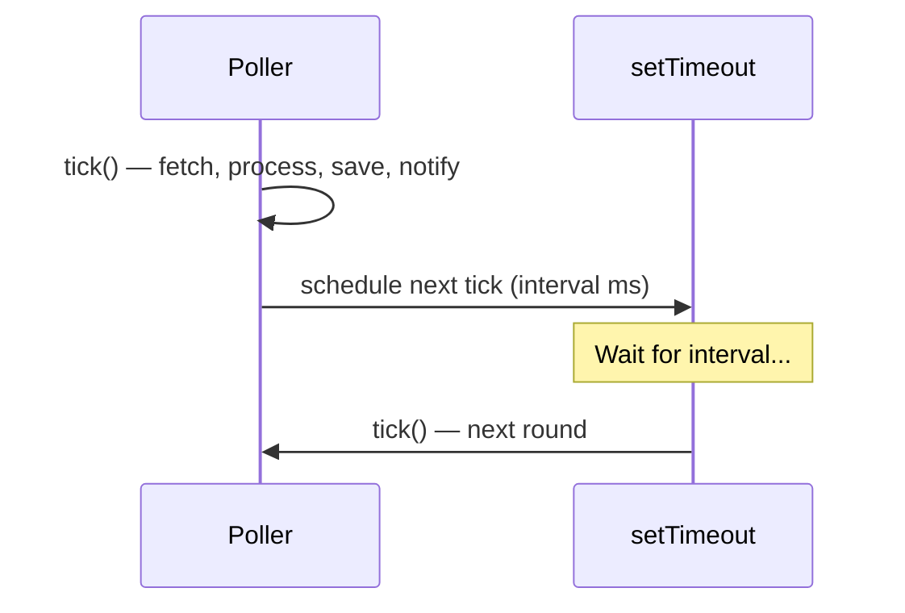

# SPX Node.js Best Practices

## Runtime Boundaries

> [!important] Startup Validation
> - ตรวจ required API env vars, numeric values, URL syntax ก่อน polling
> - CLI interval เป็น ==วินาที== (`npm run dev -- 10`) แต่ `POLL_INTERVAL_MS` เป็น ==มิลลิวินาที==
> - External API payloads ถูกตรวจใน `ApiClient` ก่อนเข้า polling/DB layers
> - `request_id` มาจาก `booking/bidding/request/list` ไม่ใช่ `booking_overview`

> [!danger] Security
> ห้าม copy `.env` values ลง docs, logs, commits, หรือ examples

## Async Polling

- `Poller` ใช้ one-shot `setTimeout` หลัง tick จบ → ไม่ใช้ `setInterval`
- ป้องกัน slow API/DB work ไม่ให้ overlap tick ถัดไป
- Detail fetching ใช้ `Promise.all` จำกัด 3 concurrent max



> [!tip] Error Isolation
> Top-level startup errors ถูก catch ใน `src/app.ts` → print โดยไม่มี stack trace
> `Poller.stop()` wait active tick → stop HTTP → close MySQL → safe exit

## API Resilience

| Feature | Implementation |
|---------|---------------|
| Retry | `fetchWithRetry()` — 3 retries, exponential backoff (1s, 2s, 4s) |
| Jitter | Random delay เพิ่มเข้า base delay |
| Session detection | retcodes 401, 403, -1, 10001, 10002 → `session_expired` |
| Cookie rotation | `setCookie()` allows runtime update without restart |
| Session alerts | Discord/LINE notification เมื่อ session expired (throttle 10 min) |

ดู [[error-handling]] สำหรับ error classification details

## Backend Worker Layers

> [!note] Layer Responsibilities
> - **Controller** (`poller.ts`) — orchestrate flow, ไม่ทำ business logic เอง
> - **Services** (`services/`) — API integration, notifications, metrics, business decisions
> - **Repositories** (`repositories/`) — direct DB access, ==ห้ามมี polling/API logic==
> - **Utils** (`utils/`) — logging, hashing, error classification

## Notifications

- `notify-rules.json` define stateful rules (origins, destinations, vehicle_types, need)
- `notify-rules.ts` re-reads file ทุก 30s → match ALL trips → auto-fulfill
- `notifier.ts` sends Discord embeds + LINE text
- Notification failures → log warning, ==ไม่ crash polling loop==
- Users แก้ไข rules ได้โดยไม่ต้อง restart

ดู [[notification-system]] สำหรับ rule lifecycle

## Auto-Accept

- Rules ที่มี `auto_accept: true` → เรียก SPX API accept จริง
- Retry 1 ครั้ง (delay 2s) เมื่อ fail
- Metrics track: attempts / success / failure
- ==Accept แล้วยกเลิกไม่ได้==

ดู [[auto-accept-engine]] สำหรับ flow diagram

## Observability

| Component | Tracks |
|-----------|--------|
| `metrics.ts` | Latency p50/p95/p99, success rate, trip counts |
| `metrics.ts` | Session health (consecutive errors, isHealthy) |
| `metrics.ts` | Auto-accept stats (attempts, success, failure) |
| `error-classifier.ts` | 6 error categories with retryable flag |
| `metrics-repository.ts` | Persist snapshots ทุก 5 นาที + before shutdown |
| `client.ts` | DB pool stats (total, idle, acquired, queued) |

ดู [[error-handling]] สำหรับ structured log format

## Database Writes

- `saveBookingRequest()` ใช้ `INSERT IGNORE` — write-once, never update
- `ensureSpxBookingHistoryTable()` share initialization promise → ป้องกัน duplicate DDL
- `closePool()` เป็น single shutdown path สำหรับทุก component
- Schema changes ต้อง sync 4 ที่: ดู [[mysql-best-practices#Schema Sources (ต้อง sync)]]

## TypeScript Conventions

> [!warning] Module Resolution
> โปรเจกต์ใช้ `moduleResolution: "NodeNext"`
> Import local files ==ต้องมี `.js` suffix== เสมอ:
> ```typescript
> import { env } from "../config/env.js";
> import { logger } from "../utils/logger.js";
> ```

## Verification

```bash
npm run build        # Strict TypeScript + esbuild bundle
npm run db:test      # Live integration test (needs real API + MySQL)
npm run flow:test    # Full flow: migrate + test
```

## ดูเพิ่มเติม
- [[backend-worker-patterns]] — Layer architecture
- [[architecture]] — System overview
- [[error-handling]] — Error classification
- [[mysql-best-practices]] — Database patterns
