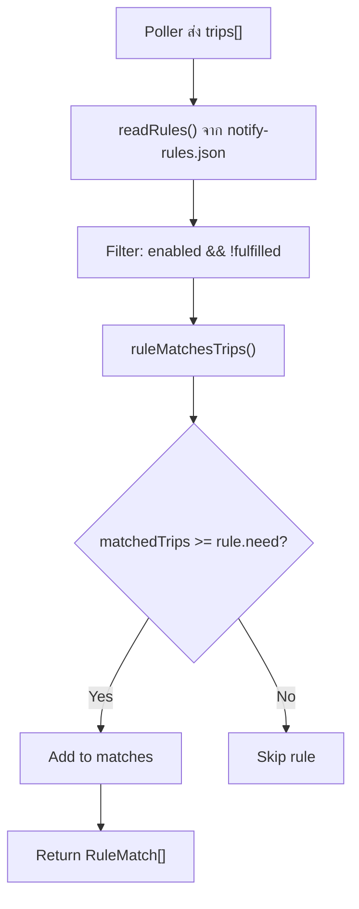
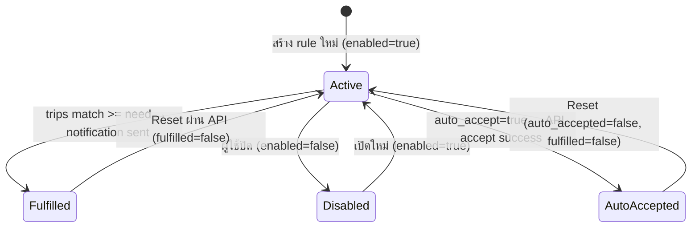

# Notification System

## Overview

ระบบ notification ของ SPX ประกอบด้วย 3 ส่วนหลัก:

1. **Rule Engine** (`notify-rules.ts`) — จับคู่ trips กับ rules
2. **Notifier** (`notifier.ts`) — ส่ง Discord/LINE messages
3. **Auto-Accept Flow** (`notifier.ts`) — รับงาน → แจ้งเตือน

## Rule Engine Flow



## Rule Structure

Rules ถูกเก็บใน `notify-rules.json` ที่ root ของ project:

```json
{
  "id": "rule_nerc_c_suvarnabhumi_4w",
  "name": "NERC-C → สุวรรณภูมิ 4ล้อ",
  "origins": ["NERC-C"],
  "destinations": ["สุวรรณภูมิ"],
  "vehicle_types": ["4ล้อ"],
  "need": 1,
  "enabled": true,
  "fulfilled": false,
  "auto_accept": false,
  "auto_accepted": false
}
```

> [!tip] การ Match
> - ถ้า `origins` ว่าง → match ทุกต้นทาง (wildcard)
> - ถ้า `destinations` ว่าง → match ทุกปลายทาง
> - ถ้า `vehicle_types` ว่าง → match ทุกประเภทรถ
> - การเปรียบเทียบใช้ `includes()` แบบ case-insensitive

## Rule Lifecycle



> [!important] Stateful Rules
> - เมื่อ rule ถูก fulfilled → `fulfilled: true` → ไม่ match อีกจนกว่า reset
> - ป้องกัน duplicate notifications
> - Auto-accept rules จะถูก mark ทั้ง `auto_accepted` และ `fulfilled`

## Notification Channels

### Discord (Rich Embed)
```typescript
// สีของ embed: 0x0ea5e9 (sky blue)
// Max description: 4096 chars (truncated)
// Timestamp: ISO 8601
```

### LINE Notify
```
POST https://notify-api.line.me/api/notify
Authorization: Bearer {LINE_NOTIFY_TOKEN}
Content-Type: application/x-www-form-urlencoded
// Max message: 3000 chars (truncated)
```

## Notification Modes

| Mode | Behavior |
|------|----------|
| `batch` (default) | รวม matches ทั้งหมดส่งในข้อความเดียว |
| `each` | ส่งแยกข้อความต่อ rule ที่ match |

## TripLike Interface

Rule engine ใช้ `TripLike` interface ที่รองรับทั้ง English และ Thai field names:

```typescript
interface TripLike {
  origin?: string;          // หรือ
  "ต้นทาง"?: unknown;       // ← fallback
  destination?: string;     // หรือ
  "ปลายทาง"?: unknown;      // ← fallback
  vehicle_type?: string;    // หรือ
  "ประเภทรถ"?: unknown;     // ← fallback
  request_id?: unknown;
  booking_id?: unknown;
}
```

## ดูเพิ่มเติม
- [[auto-accept-engine]] — Auto-accept flow ละเอียด
- [[api-routes]] — API endpoints สำหรับ rules CRUD
- [[architecture]] — ตำแหน่งของ notification ในระบบ
