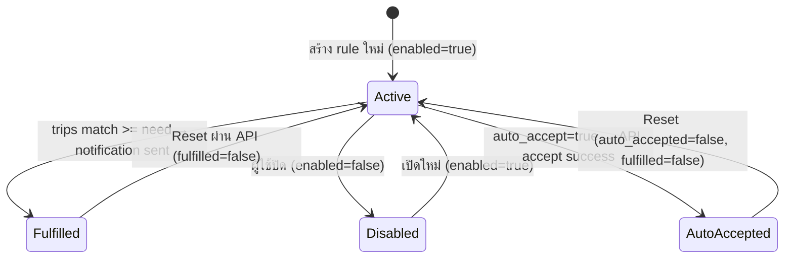

# Notification System

## Overview

ระบบ notification ของ SPX ประกอบด้วย 5 ส่วนหลัก:

1. **Rule Engine** (`notify-rules.ts`) — จับคู่ trips กับ rules
2. **Worker Publisher** (`notification-client.ts`) — worker ส่ง notification events เข้า notifier ผ่าน internal API
3. **Central Notifier** (`notifier.ts`, `internal-notification-controller.ts`) — ส่ง Discord/LINE messages จาก process กลาง
4. **Auto-Accept Flow** (`notifier.ts`) — รับงาน → แจ้งเตือน
5. **Retry Spool** (`notification-spool.ts`) — เก็บ event ที่ส่งไม่สำเร็จเพื่อ retry แบบ crash-safe

## Rule Engine Flow


## Rule Structure

Production เก็บ rules ใน DB. Local/dev ยังรองรับ `notify-rules.json` เป็น fallback:

```json
{
  "id": "rule_nerc_c_suvarnabhumi_4w",
  "name": "NERC-C → สุวรรณภูมิ 4ล้อ",
  "origins": ["NERC-C"],
  "destinations": ["สุวรรณภูมิ"],
  "vehicle_types": ["4ล้อ"],
  "need": 1,
  "enabled": true,
  "fulfilled": false,
  "auto_accept": false,
  "auto_accepted": false
}
```

> [!tip] การ Match
> - ถ้า `origins` ว่าง → match ทุกต้นทาง (wildcard)
> - ถ้า `destinations` ว่าง → match ทุกปลายทาง
> - ถ้า `vehicle_types` ว่าง → match ทุกประเภทรถ
> - การเปรียบเทียบใช้ `includes()` แบบ case-insensitive

## Rule Lifecycle



> [!important] Stateful Rules
> - เมื่อ rule ถูก fulfilled → `fulfilled: true` → ไม่ match อีกจนกว่า reset
> - ป้องกัน duplicate notifications
> - Auto-accept rules จะถูก mark ทั้ง `auto_accepted` และ `fulfilled`

## Notification Channels

### Discord (Rich Embed)
```typescript
// สีของ embed: 0x0ea5e9 (sky blue)
// Max description: 4096 chars (truncated)
// Timestamp: ISO 8601
```

### Central LINE Delivery

Production workers ไม่ส่ง LINE โดยตรง. Workers publish signed notification events เข้า notifier:

```text
worker-* -> POST /internal/notification-events -> notifier -> LINE/Discord
```

Notifier เลือก target จาก team config:

| Event Type | Target Priority |
|------------|-----------------|
| auto-accept success/partial | `autoAcceptSuccessLineGroupId` -> `lineGroupId` |
| auto-accept failure | `autoAcceptFailureLineGroupId` -> `lineGroupId` |
| general/team events | `lineGroupId` |

Secrets and targets are DB-first: global notification settings live in `app_settings`; team targets and SPX credentials live encrypted on `teams`. The old LINE Notify bearer-token path is no longer the production notification path.

### LINE Bot (LINEJS)
ใช้ `linejs` library เพื่อส่งข้อความในฐานะบัญชี LINE ปกติ หรือผ่าน LINE Official Account โดยใช้วิธีสแกน QR Code:
- ข้อมูล Session ถูกเก็บใน `data/linejs-storage.json`
- รองรับการตั้งเป้าหมาย (Target) เป็นกลุ่ม (`C...`) หรือผู้ใช้ส่วนตัว (`U...`) โดยสามารถเลือก Target MID ได้ผ่านหน้าเว็บ Settings (ดึงรายชื่อกลุ่มอัตโนมัติจาก `/api/line-bot/groups`)
- หากไม่ได้กำหนด Target จะดึงจาก `LINEJS_TEST_TARGET_ID` หรือ `LINE_USER_ID`
- มี UI สแกน QR Code แบบเรียลไทม์ และระบบตรวจสอบสถานะ Auth Status ตลอดเวลา

## Notification Modes

| Mode | Behavior |
|------|----------|
| `batch` (default) | รวม matches ทั้งหมดส่งในข้อความเดียว |
| `each` | ส่งแยกข้อความต่อ rule ที่ match |

## Runtime Metrics Bridge

Workers also publish signed runtime snapshots to the notifier:

```text
worker-* -> POST /internal/runtime-metrics -> notifier runtime metrics cache -> /metrics + SSE
```

This keeps admin/all-team Pipeline telemetry tied to the actual worker processes. A healthy production deploy should show frequent `POST /internal/runtime-metrics 200` lines in notifier logs and no `runtime-metrics-publish-failed` warnings in worker logs.

## TripLike Interface

Rule engine ใช้ `TripLike` interface ที่รองรับทั้ง English และ Thai field names:

```typescript
interface TripLike {
  origin?: string;          // หรือ
  "ต้นทาง"?: unknown;       // ← fallback
  destination?: string;     // หรือ
  "ปลายทาง"?: unknown;      // ← fallback
  vehicle_type?: string;    // หรือ
  "ประเภทรถ"?: unknown;     // ← fallback
  request_id?: unknown;
  booking_id?: unknown;
}
```

## ดูเพิ่มเติม
- [[auto-accept-engine]] — Auto-accept flow ละเอียด
- [[api-routes]] — API endpoints สำหรับ rules CRUD
- [[architecture]] — ตำแหน่งของ notification ในระบบ
