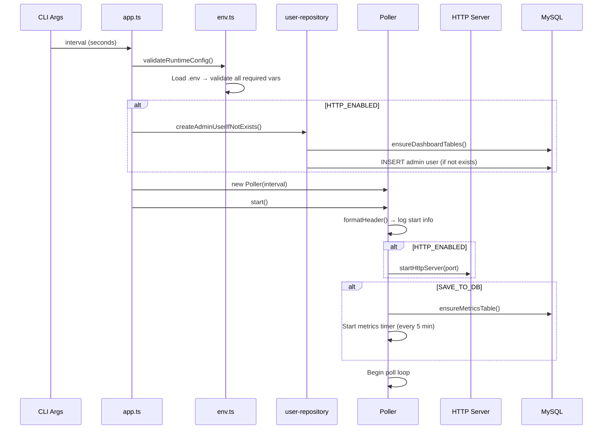
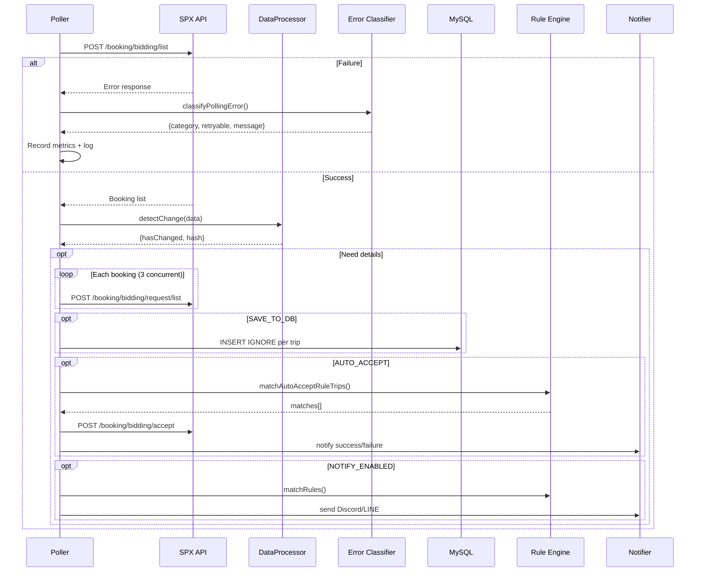

# Runtime Flow

## Startup Sequence

## Tick Flow (แต่ละรอบ polling)

1. **Check State**: ตรวจสอบว่าระบบถูกหยุดชั่วคราวผ่านหน้าเว็บ (Pause) หรือไม่ผ่าน `pollerControl.isPaused`
   - ถ้า `isPaused == true` ข้ามรอบ (skip tick) รอ 1 วินาทีแล้วเช็คใหม่
2. **Request counter** เพิ่มขึ้น
3. **ApiClient.fetch()** เรียก `POST /booking/bidding/list`
4. ถ้า request ล้มเหลว:
   - Error ถูก classify (`session_expired`, `network`, `rate_limited`, etc.)
   - Metrics updated, tick ends
5. ถ้า request สำเร็จ:
   - **DataProcessor.detectChange()** — FNV-1a hash comparison
   - **formatStatus()** — log summary (bookings count, change status)
   - ถ้า `FETCH_DETAILS` | `SAVE_TO_DB` | `NOTIFY_ENABLED` | `AUTO_ACCEPT_ENABLED`:
     - Tick schedule งานรายละเอียดเข้า background แล้วจบรอบทันที เพื่อให้ `booking/bidding/list` รอบถัดไปไม่ต้องรอ `request/list`
     - Background fetch request list per booking ด้วย worker pool (`BOOKING_DETAIL_CONCURRENCY`, default 8)
     - ถ้าเปิดเฉพาะ `AUTO_ACCEPT_ENABLED` และ rule ระบุต้นทางไว้ จะข้าม booking ที่ `booking_name` ไม่ตรงต้นทางก่อนเรียก `request/list`
     - ถ้ามี `SAVE_TO_DB` / `NOTIFY_ENABLED` / `FETCH_DETAILS` จะไม่ข้าม แต่จะจัด booking ที่ต้นทางตรงขึ้นก่อน
     - **extractAllRequestListTrips()** — แปลง API response → `ExtractedTripInfo[]`
     - ถ้า `AUTO_ACCEPT_ENABLED`: booking ที่ดึงเสร็จก่อนจะเข้า auto-accept queue ทันที
     - Print trip info ถ้า `FETCH_DETAILS`
   - ถ้า `SAVE_TO_DB`:
     - `INSERT IGNORE` each trip → `spx_booking_history`
   - ถ้า `AUTO_ACCEPT_ENABLED`:
     - **matchAutoAcceptRuleTrips()** → accept via API → notify
   - ถ้า `NOTIFY_ENABLED`:
     - **notifyMatchedRules()** → Discord/LINE

## Tick Flow Diagram

## Shutdown Sequence

1. `SIGINT` หรือ `SIGTERM` triggers `Poller.stop()`
2. Stop poll timer (`clearTimeout`)
3. Stop metrics persistence timer (`clearInterval`)
4. Persist ==final metrics snapshot== ก่อน shutdown
5. Wait for active tick to complete (if any)
6. `formatFooter()` — print final stats
7. Stop HTTP server
8. Close MySQL pool
9. `process.exit(exitCode)`

## Error Handling Style

> [!tip] Key Principles
> - **Non-fatal polling errors** → log + skip tick → retry next interval
> - **Duplicate DB saves** → treated as "skipped", not errors
> - **Notification failures** → channels are independent (Discord fail ≠ LINE fail)
> - **Shutdown failures** → logged before forced exit
> - **Session expiry** → classified, logged as `session_expired` category

## Metrics Persistence

> [!note] New Feature
> Metrics ถูก persist ลง DB ทุก 5 นาที + ก่อน shutdown
> - ป้องกัน data loss หลัง restart
> - Query ผ่าน `GET /metrics/history?limit=100`
> - Table: `metrics_snapshots`

## ดูเพิ่มเติม
- [[architecture]] — Component map
- [[error-handling]] — Error classification details
- [[database-schema]] — Table structures
- [[notification-system]] — Notification flow
