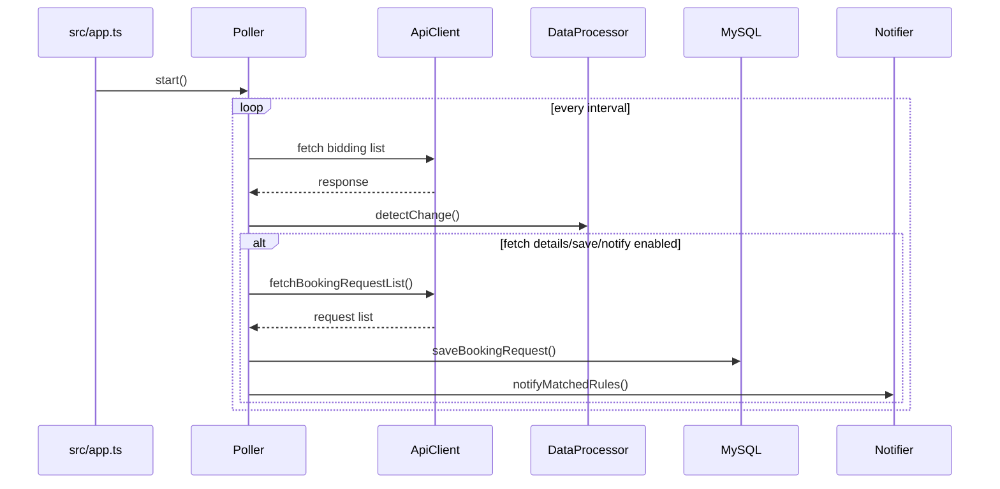

---
tags:
  - obsidian
  - spx
  - runtime
---

# Runtime Flow

## Startup
1. `src/app.ts` parses CLI interval
2. `validateRuntimeConfig()` checks env
3. if `HTTP_ENABLED=true`, DB config is required and dashboard tables are ensured
4. `Poller.start()` begins worker loop
5. if dashboard is enabled, HTTP server starts too

## Tick flow
1. request number increases
2. worker calls `ApiClient.fetch()`
3. if request fails, error metrics are recorded
4. if request succeeds:
   - change detection runs
   - summary is logged
    - detail requests may be fetched
    - trips may be saved to DB
    - notification rules may be matched against extracted trips
    - Discord/LINE notifications are sent and fulfilled rules are persisted

## Tick flow diagram

## Shutdown
1. SIGINT or SIGTERM triggers stop
2. current tick is awaited
3. HTTP server is stopped
4. MySQL pool is closed
5. process exits with proper code

## Error handling style
- known duplicate saves are treated as skipped, not fatal
- API failures are logged and metrics are updated
- `/ready` returns HTTP 503 when MySQL is not reachable
- notification channels are attempted independently; one failing channel does not block another configured channel
- shutdown failures are logged before exit
