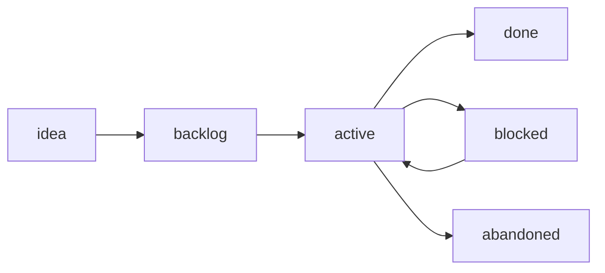

# 🎯 Goals — Long-Term Stack

> [!abstract] Purpose
> What we're working toward across sessions — so AI doesn't lose the thread between conversations.

> [!important] How agents use this
> 1. **Read at session start** (`/session-start` does this automatically).
> 2. **Reference when prioritizing** — does this task move a goal forward?
> 3. **Update on progress** — mark goals as `done` / `in-progress` / `blocked`.
> 4. **Add new goals** when user reveals long-term intent.

---

## 🔥 Active Goals (Top 3)

### G-001: Bullet-Proof Memory Vault System
- **Status:** in-progress
- **Started:** 2026-05-13
- **Target:** stable + multi-AI usage by end of week
- **Progress:**
    - [x] Bootstrap vault with 3-layer architecture
    - [x] Install Dataview + Templater + Linter
    - [x] Move vault into SPX repo
    - [x] Add auto-log mandatory rule
    - [x] Add Awakening Stack (Level 2/3/4)
    - [x] Add machine-checkable vault linter (`npm run memory:check`)
    - [x] Add retrieval protocol, runbooks, and truth-maintenance fields
    - [x] Add first real API and component docs ([[API-Bidding-Endpoints]], [[Component-Retry-With-Backoff]])
    - [x] Commit memory vault to git
    - [ ] Test multi-AI access beyond Codex (Claude Code / Cursor)
- **Owned by:** Cascade + Human
- **Why it matters:** Every minute saved on re-explaining context compounds.

### G-002: SPX Stable Production Operation
- **Status:** in-progress (ongoing)
- **Started:** 2026-04-25 (project inception)
- **Target:** zero unplanned restarts
- **Progress:**
    - [x] Dual-storage notify rules ([[ADR-001-Dual-Storage-Notify-Rules]])
    - [x] Auto-deploy via git push to main
    - [x] Health check at `GET /ready`
    - [ ] Define alerting policy
    - [ ] Add metrics dashboard for poll latency
- **Owned by:** Human
- **Why it matters:** Production reliability = user trust.

### G-003: Reduce Re-Explanation by 80%
- **Status:** in-progress
- **Started:** 2026-05-13
- **Target:** by 2026-06-13
- **Progress:**
    - [x] AGENTS.md project-level
    - [x] Memory Vault with session logs
    - [x] Agent identity file
    - [x] Mistake registry
    - [ ] Measure: count messages of "remember when..." across 4 weeks
- **Owned by:** AI + Human
- **Why it matters:** Force-multiplier for future sessions.

---

## 🔁 Recurring Maintenance

### M-001: Monthly Vault Compactor
- **Status:** active (recurring)
- **Cadence:** 1st of each month
- **Next run:** 2026-06-01
- **Steps:** Run `/dream` workflow → see `.windsurf/workflows/dream.md`
- **Owner:** Cascade (with human review)
- **Why:** Without periodic compaction, insights stay buried in session logs and memory rots.
- **Outcomes to verify:**
    - [ ] Promote recurring insights to `07_Insights/`
    - [ ] Mark stale notes (90+ days) as archived
    - [ ] Verify runbook `last-verified:` dates not > 90 days old
    - [ ] Refresh `MOC-Home` if topology changed
    - [ ] Write `05_Agent_Session_Logs/YYYY-MM-01-Dream-Compactor.md`

### M-002: Runbook Re-Verification
- **Status:** active (recurring)
- **Cadence:** every 90 days per runbook
- **Steps:** Walk through each runbook's procedure → update `last-verified:`
- **Owner:** Human + Cascade
- **Why:** Production behaviors change; stale runbooks are dangerous.

---

## 📋 Goal Backlog (Not Yet Active)

```dataview
TABLE status, owner AS "Owner", started AS "Started"
FROM "00_Index"
WHERE type = "goals" AND file.name = "Goals"
```

### G-004: Add `02_API_Docs/` Content
- **Status:** in-progress
- **Progress:**
    - [x] Bootstrap folder index: [[02_API_Docs/README]]
    - [x] First real API doc: [[API-Bidding-Endpoints]]
    - [ ] Add internal HTTP API docs (`API-Internal-HTTP.md`)
    - [ ] Add SSE event payload docs (`API-SSE-Events.md`)
- **Why:** SPX bidding API endpoints and internal HTTP contracts need source-grounded notes so future AI can work without rediscovering endpoint behavior from code every session.
- **Trigger to start:** Next API change or major refactor.

### G-005: Add `03_Reusable_Components/` Content
- **Status:** in-progress
- **Progress:**
    - [x] Bootstrap folder index: [[03_Reusable_Components/README]]
    - [x] First real component doc: [[Component-Retry-With-Backoff]]
    - [ ] Add dual-storage repository pattern doc
    - [ ] Add poller tick / graceful shutdown pattern doc
- **Why:** Poller pattern, DB migration pattern, notify pipeline, retry/backoff, and SSE patterns are reusable and should be documented at the point they become relevant.
- **Trigger to start:** Pattern needs to be reused.

### G-006: Multi-Agent Orchestration (Aspirational)
- **Status:** backlog (aspirational)
- **Why:** Run security-agent, test-agent, docs-agent in parallel like [[LeafBox-02-Claude-Code-Updates#3]] describes.
- **Trigger to start:** Tooling matures (Claude Code multi-agent GA).

---

## ✅ Recently Completed (Last 30 Days)

| Goal | Completed | Outcome |
|---|---|---|
| Memory Vault bootstrap | 2026-05-13 | 21 files, 8 folders, 3 plugins active |
| Move vault to SPX repo | 2026-05-13 | All AI tools now access shared memory |
| Auto-log rule | 2026-05-13 | 3-layer enforcement (project + vault + Cascade memory) |
| Awakening Stack | 2026-05-13 | Level 2/3/4 — reflection, identity, self-check |
| First API/component docs | 2026-05-13 | [[API-Bidding-Endpoints]] + [[Component-Retry-With-Backoff]] |

---

## 🚫 Abandoned / Deferred

(none yet)

---

## Goal Lifecycle



| State | When to use |
|---|---|
| `backlog` | Goal recognized but not started |
| `active` | Currently working toward |
| `in-progress` | Same as active (synonym) |
| `blocked` | Stuck on external dependency |
| `done` | Completed — move to "Recently Completed" |
| `abandoned` | Decided not to pursue — keep entry with reason |

---

## How To Add a New Goal

1. Use ID pattern `G-NNN` (zero-padded, sequential, never reused).
2. Place in **"Active Goals"** if starting now, or **"Backlog"** otherwise.
3. Required fields: status, target (date or condition), why-it-matters, owner.
4. Link to relevant session log when the goal is set.
5. Update `updated:` frontmatter.

---

## Related

- [[AGENT-IDENTITY]] — my role + how goals relate to identity
- [[MOC-Home]] — navigation
- [[AGENTS]] — vault constitution
- Active sessions: `05_Agent_Session_Logs/`
