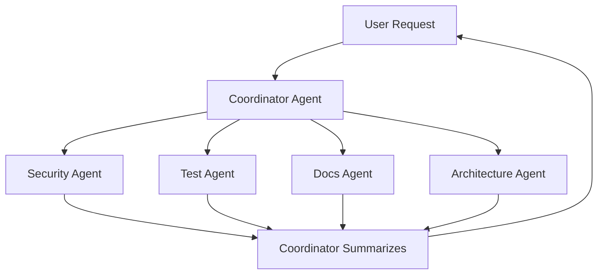

# LeafBox-02 — Claude Code ไม่ได้มาอัปเดตฟีเจอร์… แต่มาเปลี่ยนวิธีทำงานทั้งทีม

> [!abstract] Core thesis
> Anthropic ไม่ได้แค่ทำให้ Claude Code "เขียนโค้ดเร็วขึ้น" — กำลังเปลี่ยนมันเป็น **"ทีมงาน AI"** ที่รันงานเอง, ตรวจคุณภาพเอง, แบ่งงานเอง, และจำบริบทระยะยาว.

## Source Info

- **Author:** LeafBox Digest (นิว)
- **Origin:** สรุปจากงาน **Code with Claude**
- **Focus:** 5 อัปเดตใหญ่ที่เปลี่ยน workflow

## The 5 Big Updates

### 1. Routines — Schedule / Webhook / GitHub Event Triggered

> AI ทำงานเองตามรอบ ไม่ต้องรอเราเรียก

- Schedule (cron)
- API webhook
- GitHub event (PR, release, deploy)

**Examples:** auto-review PR, check docs drift, run nightly health checks.

**Analogy:** Junior dev + automation bot ที่ทำงาน proactive.

### 2. Outcomes — Rubric-Driven Iteration

> ไม่ใช่แค่ "ช่วยทำงานนี้" → บอก "งานที่ดีต้องผ่านเกณฑ์อะไรบ้าง"

**Rubric examples:**
- Tests ต้องผ่าน
- Docs ต้องอัปเดต
- Risk ต้องถูก review
- Output ต้องพร้อมส่งต่อ

→ Agent ประเมินตัวเอง + iterate จนผ่าน

> [!quote] Quote
> "เปลี่ยน AI จาก **คนตอบคำถาม** เป็น **คนส่งมอบงาน**"

### 3. Multi-Agent Orchestration

> Coordinator agent แตกงานให้ specialist agents

**Specialists examples:**
- security agent — vuln scanning
- testing agent — regression checks
- docs agent — keep docs aligned
- research agent — context gathering

### 4. Dreams — Memory Maintenance

> Agent อ่าน session เก่า → จัดระเบียบใหม่ → ดึง insight → ลด noise

**Why?** Memory ที่ทำงานนานๆ จะ:
- มีข้อมูลซ้ำ
- มีข้อมูลขัดแย้ง
- มีข้อมูลที่หมดอายุ

→ "Dreams" = automated compactor + summarizer

> [!info] Mapping to this vault
> เราใช้แนวคิดเดียวกันใน [[Context-Rot-Prevention]] → monthly compactor pass.

### 5. SpaceX Capacity + Usage Limits

> ไม่ใช่แค่ "ใช้ได้เยอะขึ้น" — มันคือ infra ที่รองรับ agentic workflow

**Why agentic workflow ใช้ compute หนัก?**
- Tool calls หลายรอบ
- อ่าน repo
- Run tests
- Spawn multiple agents
- Iterate quality gates

**Action:**
- เพิ่ม capacity ผ่านดีลกับ SpaceX
- เพิ่ม 5-hour rate limits เป็น **2x** (Pro/Max/Team/Enterprise)

## Key Takeaways

> [!important] Mindset shift
> Claude Code = **operating layer สำหรับทีม software ยุคใหม่** — ไม่ใช่แค่ "AI ช่วยเขียนโค้ด" อีกต่อไป.

**Questions to ask your team:**
1. งานซ้ำๆ ในบริษัทไหน → ควรเปลี่ยนเป็น **Routine**?
2. งานที่ต้องตรวจคุณภาพซ้ำๆ → ควรเปลี่ยนเป็น **Outcome**?
3. งานใหญ่ที่ต้องใช้หลายบทบาท → ควรเปลี่ยนเป็น **Multi-agent workflow**?

## Distilled Insights → Linked

- [[Agent-Orchestration-Patterns]] — multi-agent + outcomes detail
- [[Context-Rot-Prevention]] — Dreams pattern adapted

## My Notes

> [!example] Mapping features → vault practices
> | Claude feature | Our vault adaptation |
> |---|---|
> | CLAUDE.md | [[AGENTS.md]] (tool-agnostic) |
> | Auto-memory | session logs in `05_Agent_Session_Logs/` |
> | Dreams | monthly compactor (see [[Context-Rot-Prevention]]) |
> | Outcomes | rubric in template frontmatter (future) |

> [!todo] Open ideas
> - [ ] เพิ่ม "outcomes" field ใน [[Template-Session-Log]]
> - [ ] ออกแบบ rubric file สำหรับงาน recurring
> - [ ] ดู Cascade workflows (`.windsurf/workflows/`) ที่มีแล้ว — เทียบกับ Routines

## Related Sources

- [[LeafBox-01-Memory-Vault]] — context for why memory matters
- [[LeafBox-03-Obsidian-Memory-for-AI]] — implementation pattern
