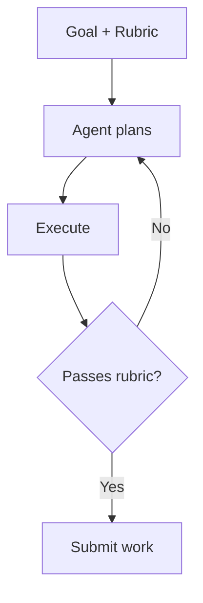
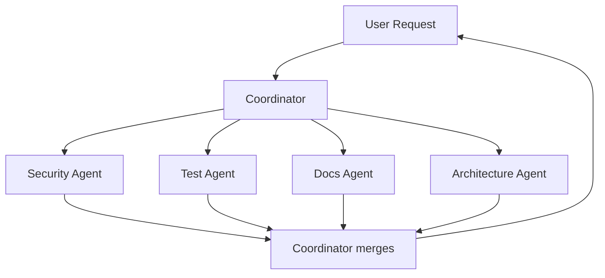
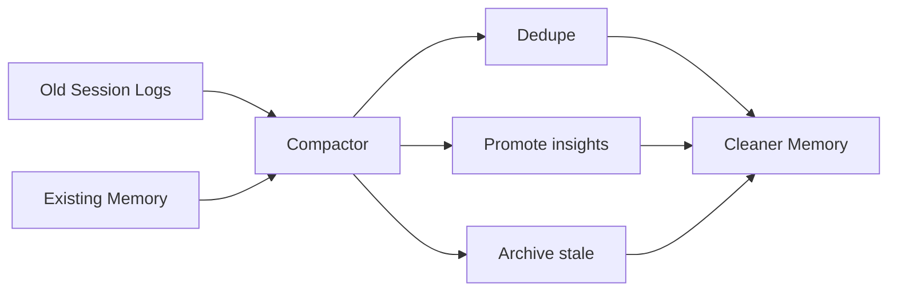

# Agent Orchestration Patterns

> [!abstract] TL;DR
> 4 patterns for working with AI agents beyond "chat one-shot": **Routine**, **Outcome**, **Multi-Agent**, **Compactor**. Distilled from [[LeafBox-02-Claude-Code-Updates]].

---

## Pattern 1 — Routine (Time / Event Triggered)

### Shape


### When To Use

- Repeatable task with a clear trigger
- Output is consumable (PR comment, Slack msg, doc update)
- Doesn't need fresh human input each time

### Examples

| Trigger | Task |
|---|---|
| Every PR opened | Lint + summary comment |
| Weekly Monday 09:00 | Generate sprint digest |
| After deploy | Verify docs match new endpoints |
| Cron nightly | Re-index session logs → insights |

### Gotchas

> [!warning]
> - Routines need **idempotency** — re-running shouldn't double-post.
> - Log everything — debugging routines is harder than interactive sessions.

### Tool-Local Command Parity

If a tool supports repo-local commands, encode the same vault ritual there instead of relying only on prose. Tools without command support should get the explicit startup prompt from [[AI-Tool-Profiles]].

Current SPX command/automation coverage:

| Tool | Repo-local mechanism | Notes |
|---|---|---|
| Cascade | `.windsurf/workflows/*.md` | Native workflow files for session, awaken, self-check, multi-perspective, dream, and review flows. |
| Cursor | `.cursor/commands/*.md` plus `.cursor/hooks/*.mjs` | Commands mirror workflows; hooks add startup, risk, closeout, and stop reminders. |
| Codex | `.agents/skills/spx-*` plus project-memory MCP | Skills provide command-equivalent workflows; Codex calls MCP lifecycle, verification, and writing tools directly. |
| OpenCode | `opencode.json` command templates | Commands mirror core Memory Vault rituals; OpenCode must restart after config edits. |

The durable pattern is **workflow parity by local adapter**: keep one ritual, encode it in each tool's native extension point, and verify the matrix in [[AI-Tool-Profiles]].

---

## Pattern 2 — Outcome (Rubric-Driven)

### Shape



### Anatomy of a Rubric

```yaml
goal: "Implement feature X"
rubric:
  - tests: "all existing tests pass + new test coverage > 80% for new code"
  - docs: "API docs updated, ADR written if architectural"
  - risk: "no new external dependencies without justification"
  - perf: "no regression in benchmark suite"
  - style: "passes project linter"
```

### When To Use

- Multi-step task with measurable quality
- "Done" has multiple dimensions
- You'd otherwise review-then-reject 5 times

### Anti-Pattern

> [!failure] Vague rubric
> ```yaml
> rubric:
>   - "make it good"
>   - "no bugs"
> ```
> → Agent can't self-evaluate → falls back to single-shot generation.

---

## Pattern 3 — Multi-Agent Orchestration

### Shape



### Specialist Examples

| Agent | Responsibility | Reads | Writes |
|---|---|---|---|
| **Security** | Vuln scanning, secret detection | Code, deps | Security report |
| **Test** | Coverage, regression | Code, test files | Test report, new tests |
| **Docs** | Doc drift, freshness | Code, docs | Doc updates |
| **Architecture** | Boundary violations, ADR alignment | Code, ADRs | Architecture notes |
| **Research** | External context gathering | Web, vault sources | Research note |

### When To Use

- Task touches multiple competencies
- Each competency has a different "lens"
- You want **parallel** work, not sequential

### Coordinator's Job

1. **Decompose** — what specialists are needed?
2. **Dispatch** — spawn / call each.
3. **Merge** — reconcile conflicts (e.g. test agent wants A, security agent wants B).
4. **Surface** — present unified result + any disagreements.

### Gotchas

> [!warning]
> - **Cost** — multi-agent uses more compute (see [[LeafBox-02-Claude-Code-Updates#5]])
> - **Determinism** — same input may produce different splits
> - **Conflict resolution** — coordinator must have authority

---

## Pattern 4 — Compactor (Memory Maintenance)

### Shape



### When To Use

- After every N sessions (we use **monthly**)
- When session log folder grows beyond ~30 files
- When AI starts citing contradicting info

### What The Compactor Does

| Action | Example |
|---|---|
| **Dedupe** | Merge 3 notes saying the same "use `kebab-case` for files" |
| **Promote** | Insight that appeared in 3 session logs → write to `07_Insights/` |
| **Archive** | Old experimental note → set `status: archived` |
| **Supersede** | New ADR replaces old → link both ways |
| **Tag prune** | Remove tags with only 1 note (probably typos) |

### See Also

- [[Context-Rot-Prevention]] — full strategy
- [[LeafBox-02-Claude-Code-Updates#4]] — "Dreams" feature (Anthropic's version)

---

## Combining Patterns

> [!example] Real-world combo: Nightly Quality Routine
> ```yaml
> routine:
>   trigger: cron "0 2 * * *"   # 2am nightly
>   outcome:
>     rubric:
>       - tests-pass: true
>       - lint-clean: true
>       - docs-drift: zero
>   orchestration:
>     - test-agent
>     - lint-agent
>     - docs-agent
>   on-failure: open issue + tag #regression
> ```

---

## Mapping to This Vault

| Pattern | Where it lives |
|---|---|
| Routines | `.windsurf/workflows/*.md` and `opencode.json` command templates |
| Outcomes | Future: rubric field in [[Template-Session-Log]] |
| Multi-agent | This vault's [[AGENTS.md]] = coordinator's brief |
| Compactor | [[Context-Rot-Prevention]] = our compactor SOP |

## Related

- [[Memory-Vault-Principles]]
- [[Context-Rot-Prevention]]
- [[LeafBox-02-Claude-Code-Updates]]
