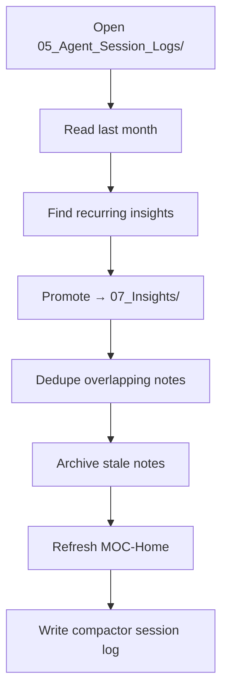

# Context Rot Prevention

> [!abstract] TL;DR
> Bigger context window ≠ better AI. The vault degrades if not maintained. This note is the **standing operating procedure (SOP)** for keeping memory healthy.

---

## What Is Context Rot?

> [!quote] Cloudflare on Agent Memory
> "Context window getting bigger ≠ better. The real game is who retrieves the **right** context at the **right** time."

**Symptoms in a vault:**

| Symptom | Root cause |
|---|---|
| AI cites contradicting info | Two notes saying opposite things, neither marked stale |
| AI ignores the vault | Files too dense / unfindable / no signal-to-noise |
| Search returns wrong note | Tags / names overlap, no canonical source |
| Decisions get re-litigated | No ADR or ADR not promoted to active memory |
| Onboarding stays slow | MOC outdated, links broken |

---

## Prevention Strategy (5 Layers)

### Layer 1 — Atomic Notes

> One fact per file. See [[Memory-Vault-Principles#3]].

**Acceptance test:** Can I summarize the note in **one sentence**? If no → split.

### Layer 2 — Frontmatter + Tags

Mandatory fields enforce findability:

```yaml
---
title: ...
type: ...
status: active | archived | superseded
created: YYYY-MM-DD
updated: YYYY-MM-DD     # ← bump on every edit
tags: [...]
---
```

**Status field is the gatekeeper.** AI should **default to ignore** `archived` and `superseded`.

### Layer 3 — Supersede Chains

When you replace a decision, **don't delete the old one**:

```yaml
# In new note ADR-005
supersedes: "[[ADR-002-...]]"
```

```yaml
# In old note ADR-002 — add this
status: superseded
superseded-by: "[[ADR-005-...]]"
```

> [!tip] Why keep old ADRs?
> Future-you (or future agent) needs to know **why we changed**. The reasoning is more valuable than the obsolete decision.

### Layer 4 — Compactor Pass

A scheduled review with these steps:



**Cadence options:**

| Cadence | Trigger | Effort |
|---|---|---|
| **Monthly** (default) | Calendar reminder | 30–60 min |
| **Threshold** | Session logs > 30 files | 30 min |
| **Event** | After a major project | 1–2 hr |

### Layer 5 — Quarterly Audit

Bigger pass — human led:

- Tags with < 2 notes → merge or remove
- Wikilinks broken (rename casualties) → fix or remove
- `00_Index/MOC-Home.md` accurate?
- `AGENTS.md` rules still match practice?
- Any folder grown beyond ~50 notes? → consider sub-foldering.

---

## Inbox Pattern

> [!info] When you don't know where to put it
> Use an **inbox** at `00_Index/Inbox.md`. Capture fast, organize weekly.

```markdown
---
title: Inbox
type: inbox
---

# Inbox

## 2026-05-13
- TODO: research alternative MCP servers
- IDEA: auto-tag inbox items via routine

## 2026-05-14
- ...
```

**Rule:** Inbox items either become a proper note within 7 days, or get deleted.

---

## Append-Only Events (Session Logs)

> [!warning] Don't edit history
> Session logs are **immutable** once written. If wrong, write a new note that supersedes it.

**Why?**
- History is data. Editing history loses signal.
- Multiple AIs / humans reading logs need stable references.

**Exception:** Typos / metadata bumps OK. **Content changes are NOT.**

---

## Concrete Anti-Patterns

> [!failure] Death by 1000 little notes
> Every passing thought becomes a file. Vault hits 500 files in a month. AI can't find anything.
>
> **Fix:** Inbox pattern + weekly triage.

> [!failure] Note graveyard
> Old notes never deleted, never archived. Search returns stale results.
>
> **Fix:** `status: archived` aggressively. Compactor pass monthly.

> [!failure] Tag explosion
> Free-form tags. 50 unique tags after 20 notes. Nothing is findable.
>
> **Fix:** Constrained taxonomy. See [[AGENTS.md#Tag Taxonomy]].

> [!failure] Wikilink decay
> Notes renamed without fixing inbound links. Graph view full of broken links.
>
> **Fix:** Use Obsidian's auto-rename. Quarterly audit catches misses.

---

## Health Metrics (How To Know It's Working)

| Metric | Target |
|---|---|
| Notes with valid frontmatter | 100% |
| Tags used in ≥ 2 notes | > 80% |
| Broken wikilinks | 0 |
| Notes with `updated:` in last 90 days OR `status: archived` | > 90% |
| MOC-Home reflects current top folders | yes |

---

## Quick SOP Card

> [!important] End-of-session checklist
> - [ ] Wrote session log to `05_*`?
> - [ ] Updated `updated:` on every edited note?
> - [ ] Added wikilinks to related notes?
> - [ ] Tagged with at least 2 tags from the taxonomy?
> - [ ] No file with > 1 unrelated H2?
>
> If all yes → ship it. Vault stays healthy.

---

## Related

- [[Memory-Vault-Principles]]
- [[Agent-Orchestration-Patterns#Pattern 4 — Compactor (Memory Maintenance)]]
- [[AGENTS.md#Memory Hygiene (Anti-Context-Rot)]]
- [[LeafBox-02-Claude-Code-Updates]] — Dreams pattern
